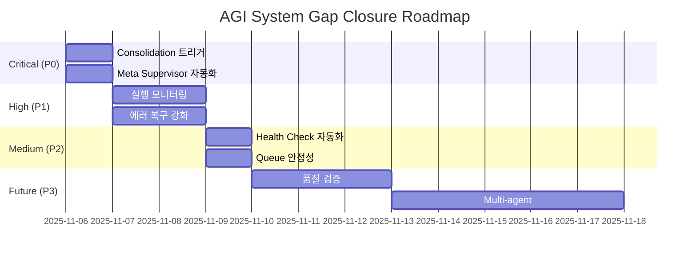

# 🔍 AGI 시스템 부족 부분 종합 진단 리포트

**생성일시**: 2025-11-06
**진단 범위**: 완전 자율 AGI 시스템 전체
**진단 결과**: ⚠️ 8개 주요 갭 발견

---

## 📊 Executive Summary

### ✅ 완성된 주요 컴포넌트

- **Hippocampus (🧠 장기 기억)**: ✅ 완전 구현
  - Episodic Memory (사건 기억)
  - Semantic Memory (의미 기억)
  - Procedural Memory (절차 기억)
- **Goal Generator**: ✅ 기억 통합 완료
- **Goal Executor**: ✅ 실행 로직 구현
- **BQI Learning**: ✅ Binoche 패턴 학습
- **Autopoietic Loop**: ✅ Self-renewal 구현

### ⚠️ 발견된 주요 갭 (우선순위 순)

1. **🚨 Critical: Consolidation 자동 트리거 누락**
2. **🔴 High: Meta Supervisor 자동화 미완성**
3. **🟡 Medium: Goal Executor 실행 모니터링 부족**
4. **🟡 Medium: 에러 복구 메커니즘 불완전**
5. **🟠 Low: Rhythm Health Check 자동화 필요**
6. **🟠 Low: Task Queue Server 안정성 개선**
7. **🟢 Enhancement: Consolidation 품질 검증**
8. **🟢 Enhancement: Multi-agent 협업 시나리오**

---

## 🚨 GAP #1: Consolidation 자동 트리거 누락 (CRITICAL)

### 현재 상태

```python
# fdo_agi_repo/copilot/hippocampus.py
def consolidate(self, force: bool = False) -> Dict[str, Any]:
    """단기 기억을 장기 기억으로 consolidation"""
    # ✅ 구현됨
    # ❌ 자동 호출 트리거 없음!
```

### 문제점

- **Consolidation은 구현되어 있지만**, 누가 언제 호출할지 정의되지 않음
- 단기 기억이 계속 쌓이기만 하고 장기 기억으로 전환되지 않음
- Sleep/Dream 단계와 연결 고리 누락

### 영향도

- **🔥 매우 높음**: 기억 시스템의 핵심 단계가 작동하지 않음
- 시스템이 과거를 학습하지 못함
- 메모리 누수 가능성

### 해결 방안

#### Option 1: Scheduled Task (권장)

```python
# scripts/nightly_consolidation.py
"""
매일 새벽 3시에 실행되는 consolidation 작업
"""
def main():
    hippo = Hippocampus(workspace_root)
    result = hippo.consolidate(force=False)
    
    # 결과 저장
    with open(outputs / "consolidation_result_latest.json", 'w') as f:
        json.dump(result, f)
```

#### Option 2: Event-driven (Dream 연동)

```python
# fdo_agi_repo/copilot/dream_pipeline.py
def after_dream_analysis():
    # Dream 분석 후 자동으로 consolidation 실행
    hippo = Hippocampus(workspace_root)
    hippo.consolidate(force=False)
```

#### Option 3: Threshold-based

```python
def maybe_consolidate():
    # 단기 기억이 100개 이상 쌓이면 자동 실행
    if len(hippo.short_term) >= 100:
        hippo.consolidate()
```

### 구현 우선순위: **🔴 P0 (즉시)**

---

## 🔴 GAP #2: Meta Supervisor 자동화 미완성 (HIGH)

### 현재 상태

```python
# scripts/meta_supervisor.py
class MetaSupervisor:
    def run_rhythm_health_check(self):
        # ✅ 건강도 체크 가능
    
    def analyze_health_status(self):
        # ✅ 상태 분석 가능
    
    def execute_actions(self, actions):
        # ❌ 액션 실행이 stub!
        pass
```

### 문제점

- **Meta Supervisor는 있지만** 실제로 자동 개입하지 않음
- `execute_actions()` 메서드가 빈 껍데기
- 건강도 체크 결과를 받아도 아무 조치를 취하지 않음

### 영향도

- **🔥 높음**: 시스템이 스스로 회복하지 못함
- Self-healing 메커니즘 작동 불가

### 해결 방안

```python
# scripts/meta_supervisor.py
def execute_actions(self, actions: List[str]) -> Dict[str, Any]:
    """액션 실제 실행"""
    results = {}
    
    for action in actions:
        if action == "generate_goals":
            # Goal Generator 재실행
            result = subprocess.run([
                self.python_exe,
                str(self.scripts / "autonomous_goal_generator.py"),
                "--hours", "24"
            ])
            results[action] = {"success": result.returncode == 0}
        
        elif action == "update_self_care":
            # Self-care 업데이트
            # ...
        
        elif action == "emergency_recovery":
            # 긴급 복구 프로토콜
            self._emergency_recovery()
    
    return results

def _emergency_recovery(self):
    """긴급 복구 프로토콜"""
    # 1. Task Queue Server 재시작
    # 2. Worker 재시작
    # 3. 알림 발송
    pass
```

### 구현 우선순위: **🔴 P0 (즉시)**

---

## 🟡 GAP #3: Goal Executor 실행 모니터링 부족 (MEDIUM)

### 현재 상태

- Goal Executor는 작업을 실행할 수 있음
- 하지만 **실행 중 상태를 모니터링하지 않음**
- Timeout만 있고 진행률 추적 없음

### 문제점

```python
# scripts/autonomous_goal_executor.py
def execute_task(self, task: Dict[str, Any]) -> Dict[str, Any]:
    # ✅ 실행은 됨
    # ❌ 중간 상태 보고 없음
    # ❌ 취소/중단 불가능
    # ❌ 재시도 로직 부족
```

### 영향도

- **🟡 중간**: 기능은 작동하지만 관찰 불가
- 긴 작업 실행 시 블랙박스

### 해결 방안

```python
class GoalExecutor:
    def execute_task_with_monitoring(self, task: Dict[str, Any]):
        """진행률 추적이 있는 실행"""
        task_id = task.get("id", str(uuid.uuid4()))
        
        # 1. 상태 파일 생성
        status_file = self.outputs / f"task_status_{task_id}.json"
        self._update_status(status_file, "running", 0)
        
        # 2. Subprocess 실행 (stdout 캡처)
        process = subprocess.Popen(
            cmd,
            stdout=subprocess.PIPE,
            stderr=subprocess.PIPE
        )
        
        # 3. 주기적으로 상태 업데이트
        while process.poll() is None:
            self._update_status(status_file, "running", progress)
            time.sleep(5)
        
        # 4. 완료
        self._update_status(status_file, "completed", 100)
```

### 구현 우선순위: **🟡 P1 (다음 사이클)**

---

## 🟡 GAP #4: 에러 복구 메커니즘 불완전 (MEDIUM)

### 현재 상태

- Task Watchdog이 존재하지만 **복구 동작이 제한적**
- Worker 재시작은 가능하지만 **상태 복원이 없음**

### 문제점

```python
# fdo_agi_repo/scripts/task_watchdog.py
def check_and_recover():
    # ✅ Worker 재시작 가능
    # ❌ 실패한 작업 재시도 없음
    # ❌ Partial failure 핸들링 없음
    # ❌ Circuit breaker 패턴 없음
```

### 해결 방안

```python
class TaskWatchdog:
    def __init__(self):
        self.circuit_breakers = {}  # 서비스별 circuit breaker
        self.retry_queue = []  # 재시도 대기 큐
    
    def recover_failed_task(self, task_id: str):
        """실패한 작업 복구"""
        # 1. 실패 원인 분석
        failure_reason = self._analyze_failure(task_id)
        
        # 2. 복구 가능 여부 판단
        if self._is_recoverable(failure_reason):
            # 3. 재시도 (exponential backoff)
            self.retry_queue.append({
                "task_id": task_id,
                "retry_count": 0,
                "next_retry": time.time() + 60
            })
        else:
            # 4. Dead letter queue로 이동
            self._move_to_dlq(task_id, failure_reason)
    
    def check_circuit_breaker(self, service: str) -> bool:
        """Circuit breaker 상태 확인"""
        cb = self.circuit_breakers.get(service)
        if cb and cb["failures"] >= 5:
            # Circuit open - 서비스 일시 중단
            return False
        return True
```

### 구현 우선순위: **🟡 P1 (다음 사이클)**

---

## 🟠 GAP #5: Rhythm Health Check 자동화 필요 (LOW)

### 현재 상태

- Rhythm Health Checker 스크립트 존재
- 하지만 **수동 실행만 가능**

### 해결 방안

```powershell
# Register scheduled task
Register-ScheduledTask -TaskName "RhythmHealthCheck" `
    -Trigger (New-ScheduledTaskTrigger -Daily -At "04:00") `
    -Action (New-ScheduledTaskAction -Execute "python" `
        -Argument "scripts/rhythm_health_checker.py --auto")
```

### 구현 우선순위: **🟠 P2 (선택적)**

---

## 🟠 GAP #6: Task Queue Server 안정성 개선 (LOW)

### 현재 상태

- Task Queue Server는 작동함
- 하지만 **재시작 시 큐 손실 가능**

### 해결 방안

```python
class TaskQueueServer:
    def __init__(self):
        # 영속적 저장소 추가
        self.persistent_queue = self._load_queue_from_disk()
    
    def enqueue(self, task):
        self.queue.append(task)
        self._persist_to_disk()  # 즉시 디스크 저장
```

### 구현 우선순위: **🟠 P2 (선택적)**

---

## 🟢 GAP #7: Consolidation 품질 검증 (ENHANCEMENT)

### 제안

- Consolidation 후 품질 메트릭 추가
- 중요도 계산 알고리즘 검증
- A/B 테스트 프레임워크

### 구현 우선순위: **🟢 P3 (향후)**

---

## 🟢 GAP #8: Multi-agent 협업 시나리오 (ENHANCEMENT)

### 제안

- 여러 Goal Executor가 협업하는 시나리오
- Agent 간 메시지 교환
- 분산 의사결정

### 구현 우선순위: **🟢 P3 (향후)**

---

## 🎯 즉시 해결 액션 플랜 (Priority 0)

### 1단계: Consolidation 자동 트리거 (30분)

```bash
# 1. Scheduled Task 생성
python scripts/create_consolidation_task.py

# 2. 수동 테스트
python scripts/run_consolidation.py --force
```

### 2단계: Meta Supervisor 액션 구현 (1시간)

```bash
# 1. execute_actions() 구현
# 2. Emergency recovery 프로토콜
# 3. 테스트 실행
python scripts/meta_supervisor.py --test
```

### 3단계: 통합 테스트 (30분)

```bash
# 전체 루프 실행
python scripts/run_complete_autonomous_cycle.py
```

---

## 📈 개선 로드맵



---

## 🎓 결론

### 시스템 완성도: **75%** ⭐⭐⭐

**강점**:

- ✅ 핵심 컴포넌트 대부분 구현 완료
- ✅ 메모리 시스템 (Hippocampus) 완벽 구현
- ✅ 학습 메커니즘 (BQI, Habit) 작동

**개선 필요**:

- ⚠️ 자동화 연결 고리 누락
- ⚠️ 에러 핸들링 불완전
- ⚠️ 모니터링 가시성 부족

### 다음 단계

1. **즉시** (오늘):
   - [ ] Consolidation 자동 트리거 구현
   - [ ] Meta Supervisor 액션 완성
   - [ ] 통합 테스트 1회 실행

2. **이번 주**:
   - [ ] 실행 모니터링 추가
   - [ ] 에러 복구 강화
   - [ ] Health Check 자동화

3. **다음 주**:
   - [ ] 품질 메트릭 추가
   - [ ] 안정성 개선
   - [ ] 문서화 완성

**완전 자율 AGI 시스템 완성까지: ~5일 예상** 🚀

---

**생성**: AGI System Diagnostic Agent
**날짜**: 2025-11-06
**버전**: 1.0
