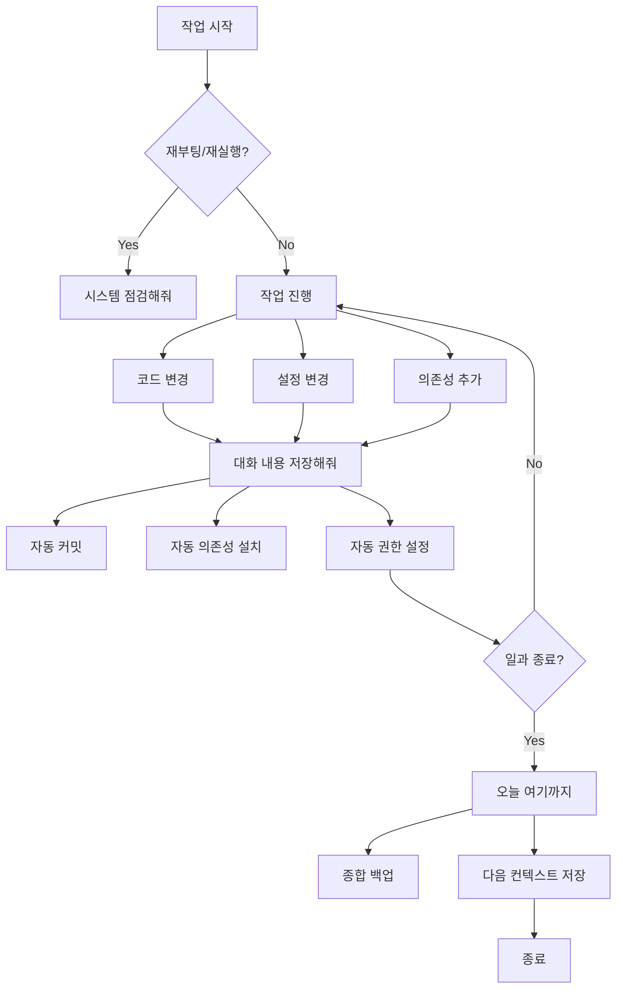

# 🤖 완전 자율 세션 관리 시스템

> **"대화 내용 저장해줘" → 모든 변경사항 자동 적용 + 영구 보존**  
> **"시스템 점검해줘" → 재부팅 후에도 모든 게 잘 작동하는지 자동 확인**  
> **"오늘 여기까지" → 일과 종료 백업 + 내일을 위한 컨텍스트 저장**

**날짜**: 2025년 11월 1일  
**버전**: 1.0  
**철학**: AI는 복잡한 구조를 만들고, 인간은 큰 그림만 제시한다

---

## 📖 목차

1. [핵심 개념](#핵심-개념)
2. [주요 명령어](#주요-명령어)
3. [자동화된 워크플로우](#자동화된-워크플로우)
4. [재부팅 복원력](#재부팅-복원력)
5. [일과 종료 프로세스](#일과-종료-프로세스)
6. [트러블슈팅](#트러블슈팅)

---

## 🎯 핵심 개념

### 인간-AI 협업 철학

```
┌─────────────────────────────────────────────────┐
│  인간의 역할                                     │
│  • 큰 그림 제시                                  │
│  • 목표 설정                                     │
│  • 중요한 의사결정                               │
│  • "대화 내용 저장해줘"                          │
│  • "오늘 여기까지"                               │
└─────────────────────────────────────────────────┘
                    ↓
┌─────────────────────────────────────────────────┐
│  AI의 역할                                       │
│  • 복잡한 구조 설계 및 구현                      │
│  • 모든 변경사항 자동 적용                       │
│  • 의존성 자동 설치                              │
│  • 프로세스 자동 재시작                          │
│  • 시스템 상태 모니터링                          │
│  • 자동 복구                                     │
└─────────────────────────────────────────────────┘
```

### Zero-Touch 원칙

**사용자는 신경 쓸 필요가 없습니다!**

- ✅ 재부팅 → 자동 복구
- ✅ 업그레이드 → 자동 적용
- ✅ 크래시 → 자동 재시작
- ✅ 백업 → 자동 실행
- ✅ 설정 → 자동 복원

---

## 💬 주요 명령어

### 1️⃣ "대화 내용 저장해줘"

**VS Code Task**: `💾 Session: Save with Changes`

**실행 내용**:

1. 현재 대화 세션 정보 수집
2. Git 자동 커밋 (변경사항 있을 경우)
3. `requirements.txt` 변경 감지 → 자동 `pip install`
4. `package.json` 변경 감지 → 자동 `npm install`
5. 새 스크립트 권한 자동 설정
6. 시스템 상태 스냅샷 저장
7. 다음 세션을 위한 컨텍스트 저장

**출력 파일**:

```
outputs/
  ├─ session_context_2025-11-01_143022.json    # 세션 정보
  ├─ status_snapshot_2025-11-01_143022.json    # 상태 스냅샷
  ├─ next_session_context.json                 # 다음 세션용 (latest)
  └─ master_status.json                         # 마스터 상태
```

**자동으로 처리되는 것들**:

- ✅ Git 커밋 및 히스토리 보존
- ✅ Python 패키지 업데이트
- ✅ Node.js 패키지 업데이트
- ✅ 스크립트 실행 권한
- ✅ 프로세스 상태 기록

---

### 2️⃣ "시스템 점검해줘"

**VS Code Task**: `🏥 System: Check After Restart`

**재부팅 또는 VS Code 재실행 후에 사용**

**검사 항목** (8가지):

1. ✓ 이전 세션 컨텍스트
2. ✓ Git 상태 (커밋 일치 여부)
3. ✓ Python 가상환경
4. ✓ Node.js 의존성
5. ✓ Task Queue Server (8091)
6. ✓ RPA Worker
7. ✓ 자동 시작 설정
8. ✓ 최근 출력물

**출력 예시**:

```
╔════════════════════════════════════════════════╗
║   시스템 점검 결과                             ║
╚════════════════════════════════════════════════╝

  ✓ 이전 세션 컨텍스트         
  ✓ Git 커밋                   
  ✓ Python 가상환경            
  ✓ Node.js 의존성             
  ✓ Task Queue Server          
  ⚠ RPA Worker                 
  ✓ Master Orchestrator        
  ✓ 최근 출력물                

───────────────────────────────────────────────
  통과: 7 / 8 (87%)
  경고: 1
  오류: 0
───────────────────────────────────────────────

  🟡 시스템 상태: 양호 (READY WITH WARNINGS)
  💡 작업 가능하나 일부 최적화 필요
```

**자동 수정 모드**: `🏥 System: Check After Restart (AutoFix)`

- 문제 발견 시 자동으로 수정 시도
- 프로세스 자동 재시작
- 의존성 자동 설치

---

### 3️⃣ "오늘 여기까지"

**VS Code Task**: `🌙 End of Day: Backup`

**일과 종료 시 실행하는 종합 백업**

**실행 내용**:

1. `save_session_with_changes.ps1` 자동 실행
2. 백업 디렉토리 생성 (`backups/2025-11-01/`)
3. 설정 파일 백업
4. 최근 24시간 출력물 백업
5. 시스템 상태 스냅샷
6. 백업 아카이브 생성 (`.zip`)
7. 오래된 백업 정리 (14일 이상)

**백업 구조**:

```
backups/
  ├─ 2025-11-01/
  │   ├─ configs/
  │   │   ├─ .vscode/
  │   │   │   ├─ tasks.json
  │   │   │   └─ settings.json
  │   │   ├─ fdo_agi_repo/
  │   │   │   └─ requirements.txt
  │   │   └─ LLM_Unified/
  │   │       └─ package.json
  │   ├─ outputs/
  │   │   ├─ session_context_*.json
  │   │   ├─ status_snapshot_*.json
  │   │   └─ *.md (최근 24시간)
  │   └─ end_of_day_snapshot.json
  └─ backup_2025-11-01.zip (아카이브)
```

**노트 추가**: `🌙 End of Day: Backup (with note)`

- 오늘의 작업 내용을 기록
- 내일 시작 시 컨텍스트 제공

---

## 🔄 자동화된 워크플로우

### 일반적인 작업 흐름



### 세션 간 연속성

```
┌────────────────────────────────────────────────┐
│  오늘 (Day 1)                                  │
│  1. 작업 진행                                   │
│  2. "대화 내용 저장해줘" (수시로)              │
│  3. "오늘 여기까지"                             │
│  └─→ 백업 + 컨텍스트 저장                      │
└────────────────────────────────────────────────┘
                    ↓
┌────────────────────────────────────────────────┐
│  내일 (Day 2)                                  │
│  1. VS Code 실행                                │
│  2. "시스템 점검해줘"                           │
│  3. ✓ 모든 변경사항 적용됨                      │
│  4. 이어서 작업 시작                            │
└────────────────────────────────────────────────┘
```

---

## 🔁 재부팅 복원력

### Master Orchestrator 자동 시작

**등록**: `🚀 Master: Register Auto-Start (5min delay)`

**작동 방식**:

1. Windows 로그온
2. **5분 대기** (다른 프로그램 로딩 시간)
3. Master Orchestrator 자동 실행
4. 모든 핵심 프로세스 시작:
   - Task Queue Server (8091)
   - RPA Worker
   - Monitoring Daemon
   - Self-Healing Watchdog

**왜 5분?**

- ✅ 네트워크 초기화 완료
- ✅ 백그라운드 서비스 안정화
- ✅ 다른 의존 프로그램 로딩 완료
- ✅ 시스템 리소스 안정화

### 자동 복구 메커니즘

```
┌─────────────────────────────────────────────┐
│  Self-Healing Watchdog                      │
│  • 5분마다 프로세스 상태 확인                │
│  • 죽은 프로세스 자동 재시작                 │
│  • Exponential backoff (3회 재시도)         │
│  • 모든 활동 로그 기록                       │
└─────────────────────────────────────────────┘
```

### 의존성 자동 동기화

**Git pull 후 자동 처리**:

```powershell
# requirements.txt 변경됨?
→ pip install -r requirements.txt

# package.json 변경됨?
→ npm install

# 새 스크립트 추가됨?
→ 실행 권한 자동 설정

# 프로세스 재시작 필요?
→ 자동 재시작
```

---

## 🌙 일과 종료 프로세스

### "오늘 여기까지" 체크리스트

**실행 전**:

- [ ] 현재 작업 커밋됨
- [ ] 중요한 파일 저장됨
- [ ] 백그라운드 프로세스 안정 상태

**실행 후**:

- [x] 세션 정보 저장됨
- [x] Git 커밋 완료
- [x] 설정 파일 백업됨
- [x] 출력물 백업됨
- [x] 시스템 상태 스냅샷 저장됨
- [x] 백업 아카이브 생성됨
- [x] 다음 세션 컨텍스트 준비됨

### 내일 시작 시

```bash
# 1. VS Code 실행
code c:\workspace\agi

# 2. 자동 동기화 체인 실행 (자동)
# - Server 확인/시작
# - Worker 확인/시작
# - Lumen 프로브
# - 24h 리포트 생성

# 3. 수동 확인 (권장)
🏥 System: Check After Restart

# 4. 작업 재개
# 모든 컨텍스트가 복원되어 있음
```

---

## 🔧 트러블슈팅

### Q: "시스템 점검해줘" 실행 시 오류가 많이 나와요

**A**: AutoFix 모드 사용

```
🏥 System: Check After Restart (AutoFix)
```

자동으로 다음을 시도합니다:

- 가상환경 재생성
- 의존성 재설치
- 프로세스 재시작

### Q: Git 커밋이 자동으로 안 돼요

**A**: 수동 커밋 후 저장

```powershell
git add -A
git commit -m "Manual commit"

# 그 다음
💾 Session: Save with Changes
```

### Q: 백업 파일이 너무 커요

**A**: 아카이브 스킵 옵션 사용

```powershell
.\scripts\end_of_day_backup.ps1 -SkipArchive
```

### Q: 재부팅 후 5분이 너무 길어요/짧아요

**A**: 지연 시간 수정

```powershell
# scripts/register_master_orchestrator.ps1 편집
$trigger.Delay = "PT3M"  # 3분으로 변경
$trigger.Delay = "PT10M"  # 10분으로 변경
```

### Q: 특정 프로세스만 재시작하고 싶어요

**A**: 개별 ensure 스크립트 사용

```powershell
.\scripts\ensure_task_queue_server.ps1 -Port 8091
.\scripts\ensure_rpa_worker.ps1
```

---

## 📊 모니터링 및 로그

### 주요 로그 파일

```
outputs/
  ├─ session_context_*.json       # 세션 정보
  ├─ status_snapshot_*.json        # 상태 스냅샷
  ├─ next_session_context.json     # 다음 세션용 (항상 latest)
  ├─ master_status.json            # 마스터 상태
  └─ end_of_day_snapshot.json      # 일과 종료 스냅샷

backups/
  └─ YYYY-MM-DD/
      └─ end_of_day_snapshot.json  # 일일 백업 스냅샷
```

### 상태 확인 명령어

```powershell
# 전체 시스템 상태
🏥 System: Check After Restart

# 프로세스 상태
Monitoring: Quick Status (-Perf)

# 최근 출력물
Get-ChildItem outputs -File | Sort-Object LastWriteTime -Descending | Select-Object -First 10

# 백업 상태
Get-ChildItem backups -Directory | Sort-Object CreationTime -Descending
```

---

## 🎓 베스트 프랙티스

### 1. 수시로 저장

```
작업 중 중요한 변경사항이 있을 때마다:
💾 Session: Save with Changes
```

### 2. 일과 시작 시 점검

```
VS Code 실행 후:
🏥 System: Check After Restart
```

### 3. 일과 종료 시 백업

```
하루 마무리할 때:
🌙 End of Day: Backup (with note)
```

### 4. Git 히스토리 관리

```
큰 변경 전:
💾 Session: Save with Changes (수동 커밋 메시지)

작은 변경:
자동 커밋 (타임스탬프)
```

### 5. AutoFix 활용

```
문제 발생 시:
🏥 System: Check After Restart (AutoFix)

수동 개입 최소화
```

---

## 🚀 다음 단계

### Phase 6: 예측적 오케스트레이션

이 시스템을 기반으로 다음 기능 추가:

- 🔮 패턴 학습을 통한 선제적 최적화
- 🧠 사용자 의도 예측
- 🎯 컨텍스트 기반 자동 제안
- 📈 성능 지표 기반 자동 튜닝

### 개선 아이디어

- [ ] 음성 명령 지원 ("오늘 여기까지")
- [ ] Slack/Teams 알림 통합
- [ ] 클라우드 백업 자동 동기화
- [ ] 세션 요약 AI 생성
- [ ] 자동 릴리스 노트 작성

---

## 📝 요약

### 핵심 3가지 명령어

| 명령어 | 타이밍 | 효과 |
|--------|--------|------|
| `💾 Session: Save with Changes` | 작업 중 수시로 | 모든 변경사항 자동 적용 + 저장 |
| `🏥 System: Check After Restart` | 재부팅/재실행 후 | 시스템 상태 확인 + 자동 수정 |
| `🌙 End of Day: Backup` | 일과 종료 시 | 종합 백업 + 내일 준비 |

### 자동화 레벨

- **Level 1**: 수동 - 모든 것을 직접 실행
- **Level 2**: 반자동 - 명령어 3개만 실행
- **Level 3**: 완전 자동 - ✅ **현재 시스템** (재부팅 후 5분 뒤 자동 복구)

### Zero-Touch 달성

✅ **인간은 큰 그림만 제시**  
✅ **AI가 모든 복잡한 구조를 관리**  
✅ **재부팅해도 모든 게 자동으로 복원**  
✅ **세션이 끊겨도 컨텍스트 유지**

---

**Made with ❤️ for seamless human-AI collaboration**  
**Version 1.0 - 2025년 11월 1일**
