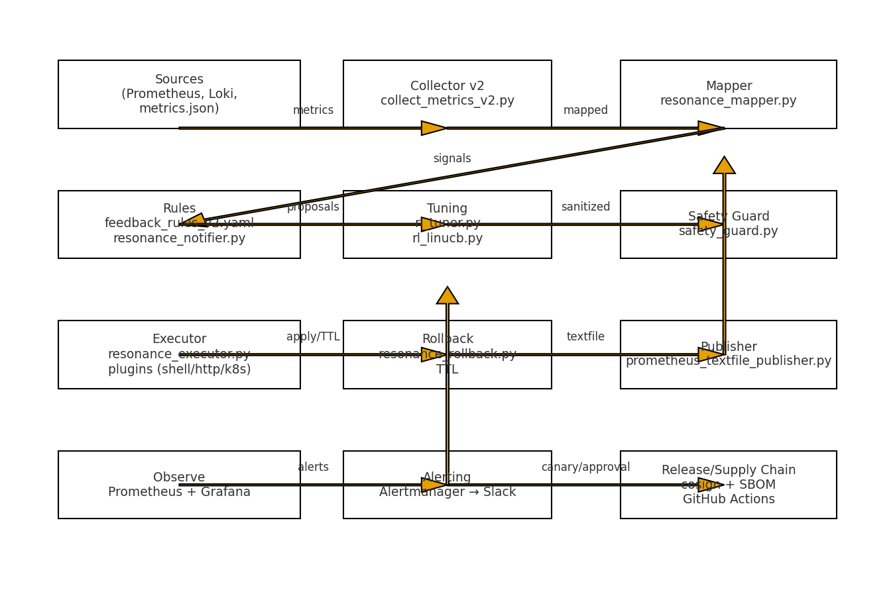

# Lumen v1.2 — Architecture & Ops One‑Pager

_Generated: 2025-10-23T07:49:32.048218Z_



## Overview
- **Goal:** Real-data + adaptive feedback + safe tuning + canary promotion with human approval.
- **Scope:** v1.1 foundation (restoration, dashboards, alerts, release security) → v1.2 (real Prom/Loki, bandit tuner, stage policy, canary + approval).

## Core Flow
1) **Collect** real SLI from Prometheus (`collect_metrics_v2.py`).  
2) **Map** to rhythm coordinates (`resonance_mapper.py`).  
3) **Propose** actions via rules (`resonance_notifier.py`) and **tune** via bandit (`rl_tuner.py`, `rl_linucb.py`).  
4) **Guard** deltas and concurrency (`safety_guard.py`).  
5) **Execute** changes (`resonance_executor.py`) and **Rollback** on TTL (`resonance_rollback.py`).  
6) **Publish** metrics to Textfile for Prometheus (`prometheus_textfile_publisher.py`).  
7) **Observe/Alert** in Grafana/Alertmanager (Slack), **Canary** check & **Approval** gate, then **Promote** or **Rollback**.

## Environments & Policy
- `stage_matrix.yaml` — per env endpoints and **policy** (`reward_mix_lambda`, `linucb_alpha`, `max_active_adjustments`, `delta_clamp`, `ttl_minutes`).
- `stage_params_sync.py` — exports env + writes `.env.<stage>`.
- `thresholds_sync.py` — syncs alert thresholds & feedback rules from stage policy.

## Canary & Approval
- Policy gates: `canary_policy.yaml` → p95 latency, error rate, coherence, phase, min samples.
- Check: `canary_check.py` → **canary_report.json**; Promote: `canary_promote.py` (DRY_RUN / SAFE_APPLY).  
- Approval (optional): `slack_approval_bridge.py` + `APPROVAL_REQUIRED=1`.

## Security & Release
- GH Actions release: image **signing (cosign)**, **SBOM** attach, Grafana snapshot append.  
- Verification: `VERIFYING.md` — cosign verify, SBOM validate, Rekor lookup.

## Runbooks
- **Go/No-Go**: `GO_NO_GO_CHECKLIST.md`  
- **Incidents**: `INCIDENT_PLAYBOOKS.md`  
- **Health**: `lumen_health_check.py` / `make verify`

## Command Cheatsheet
```bash
# Demo & report
make demo            # full E2E
make report          # LUMEN_DEMO_REPORT.md
make package         # artifact bundle

# Stages
make stage-dev       # sync policy+thresholds, run v2 loop with tuning
make params-dev      # export policy envs
make sync-thresholds-dev

# Canary
make canary-check
APPROVAL_REQUIRED=1 DRY_RUN=0 SAFE_APPLY=1 make canary-promote
make canary-rollback

# Analytics
make train-reward    # fit reward model from logs
make dash            # charts into reports/
```

## SLO-ish Guards (defaults)
- **Latency p95:** dev 600ms / staging 500ms / prod 400ms  
- **Error rate:** dev 5% / staging 3% / prod 2%  
- **Coherence min:** dev 0.50 / staging 0.55 / prod 0.60

---

### Notes
- Tune **REWARD_MIX_LAMBDA** conservatively on prod (e.g., 0.3) until logs stabilize.  
- All secrets (Slack/Grafana/Prom) must live in env or GitHub Secrets — **never in repo**.  
- Proof/audit stream: `proof_ledger.jsonl` (append-only).
