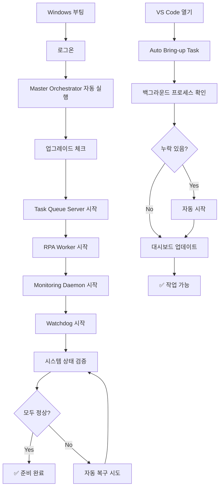
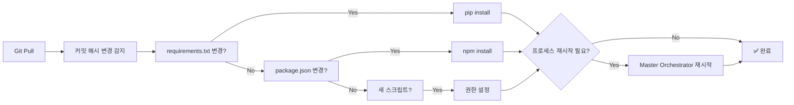

# 🚀 Reboot-Resilient Architecture

## 개요

이 시스템은 **완전 자율 복구**를 지원합니다. 데스크톱을 재부팅하거나 VS Code를 재실행해도 모든 구조와 시스템이 자동으로 복구되고, 새로운 기능도 자동으로 적용됩니다.

## 핵심 기능

### 1. 자동 부팅 시작 🌅

- Windows 로그온 시 Master Orchestrator가 자동 실행
- 모든 핵심 프로세스 자동 시작:
  - Task Queue Server (8091)
  - RPA Worker
  - Monitoring Daemon
  - Self-Healing Watchdog

### 2. 자동 업그레이드 🔄

- Git pull 후 변경 사항 감지:
  - `requirements.txt` → 자동 `pip install`
  - `package.json` → 자동 `npm install`
  - 새 스크립트 감지 → 자동 권한 설정
  - 프로세스 재시작 필요 시 자동 재시작

### 3. 자가 치유 🔧

- 5분마다 모든 핵심 프로세스 자동 체크
- 죽은 프로세스 자동 재시작
- 로그 자동 기록 (`outputs/watchdog_log.jsonl`)

### 4. 일일 자동 백업 💾

- 매일 03:30에 자동 실행:
  - 설정 파일 백업 (`.env`, `config.json` 등)
  - 핵심 출력물 백업 (대시보드, 리포트)
  - 최근 7일 로그 백업
  - Git 상태 백업
- 14일 이상 오래된 백업 자동 삭제

### 5. VS Code 자동 동기화 📝

- 워크스페이스 열 때 자동으로:
  - 백그라운드 프로세스 확인
  - 누락된 프로세스 자동 시작
  - 최신 대시보드 자동 빌드
  - 상태 요약 표시

### 6. 시스템 상태 대시보드 🏥

- 재부팅 후 자동 검증:

  ```
  ╔══════════════════════════════════════════════╗
  ║   System Health Dashboard - Post-Reboot     ║
  ╚══════════════════════════════════════════════╝
  
    ✓ Task Queue Server (8091) - Running
    ✓ RPA Worker - Active
    ✓ Monitoring Daemon - Collecting metrics
    ✓ Self-Healing Watchdog - Monitoring
    ✓ Auto-Start on Boot - Enabled
    ✓ Daily Auto-Backup - Scheduled
    ✓ Python Virtual Env - Ready
    ✓ Recent Output Files (24h) - 12 files
  
  ───────────────────────────────────────────────
    Status: 8/8 checks passed (100%)
    System Status: 🟢 ALL SYSTEMS OPERATIONAL
  ───────────────────────────────────────────────
  ```

## 사용법

### 초기 설정 (한 번만)

1. **Master Orchestrator 자동 시작 등록**:

   ```
   Task: 🚀 Master: Register Auto-Start (Boot)
   ```

   - Windows 로그온 시 자동 실행
   - 부팅 후 30초 대기 후 시작

2. **자동 백업 등록**:

   ```
   Task: 💾 Backup: Register Daily (03:30)
   ```

   - 매일 오전 3시 30분에 자동 백업

### 일상적 사용

#### 재부팅 후

1. Windows 로그온하면 자동으로 모든 것이 시작됩니다
2. VS Code를 열면 자동으로 동기화됩니다
3. 아무것도 할 필요 없습니다! ✨

#### 상태 확인

```
Task: 🏥 Health: Full System Check
```

- 모든 프로세스 상태 확인
- 시각적 대시보드 표시

#### 문제 발생 시

```
Task: 🏥 Health: Auto-Fix Issues
```

- 자동으로 문제 감지 및 복구 시도

#### 수동 업그레이드 확인

```
Task: 🔧 Upgrade: Detect and Apply
```

- Git pull 후 새 의존성 자동 설치

#### 즉시 백업

```
Task: 💾 Backup: Run Now
```

- 예약을 기다리지 않고 즉시 백업

### VS Code Tasks

#### 자동 실행 (워크스페이스 열 때)

- `Auto: Bring-up on VS Code Open (safe)`
  - 자동으로 체인 실행:
    1. Server 확인
    2. Worker 확인
    3. Core 프로브
    4. 모니터링 리포트 생성
    5. Realtime 대시보드 빌드

#### 마스터 제어

- `🚀 Master: Start Orchestrator` - 즉시 모든 시스템 시작
- `🚀 Master: Register Auto-Start (Boot)` - 부팅 시 자동 시작 등록
- `🚀 Master: Unregister Auto-Start` - 자동 시작 해제
- `🚀 Master: Check Status` - 등록 상태 확인

#### 업그레이드

- `🔧 Upgrade: Detect and Apply` - 변경 사항 감지 및 적용
- `🔧 Upgrade: Dry-Run` - 시뮬레이션만 (실제 적용 안 함)

#### 상태 체크

- `🏥 Health: Full System Check` - 전체 시스템 검증
- `🏥 Health: Auto-Fix Issues` - 자동 복구 시도

#### 백업

- `💾 Backup: Register Daily (03:30)` - 일일 백업 등록
- `💾 Backup: Run Now` - 즉시 백업

## 재부팅 후 자동 흐름



## 업그레이드 흐름



## 백업 구조

```
backups/
├── 20250101_033000/
│   ├── configs/
│   │   ├── .env
│   │   ├── config.json
│   │   └── tasks.json
│   ├── outputs/
│   │   ├── performance_dashboard_latest.md
│   │   ├── monitoring_report_latest.md
│   │   └── realtime_summary_latest.json
│   ├── logs/
│   │   ├── system_metrics.jsonl
│   │   └── watchdog_log.jsonl
│   └── git_state.json
├── 20250102_033000/
...
```

## 로그 파일

- `outputs/auto_upgrade_log.jsonl` - 업그레이드 이력
- `outputs/watchdog_log.jsonl` - Watchdog 활동 로그
- `outputs/master_orchestrator_log.jsonl` - 마스터 오케스트레이터 로그

## 트러블슈팅

### 프로세스가 자동으로 시작되지 않음

1. Master Orchestrator 등록 확인:

   ```
   Task: 🚀 Master: Check Status
   ```

2. 수동 시작:

   ```
   Task: 🚀 Master: Start Orchestrator
   ```

### 업그레이드가 적용되지 않음

1. 수동 업그레이드 실행:

   ```
   Task: 🔧 Upgrade: Detect and Apply
   ```

2. 로그 확인:

   ```powershell
   Get-Content outputs/auto_upgrade_log.jsonl -Tail 10
   ```

### 백업이 실행되지 않음

1. 스케줄 확인:

   ```
   Task: 💾 Backup: Check Status
   ```

2. 수동 백업:

   ```
   Task: 💾 Backup: Run Now
   ```

### 시스템 상태 확인

```
Task: 🏥 Health: Full System Check
```

- 모든 체크가 ✓인지 확인
- ✗가 있다면 `Auto-Fix Issues` 실행

## 장점

✅ **완전 자율**: 재부팅해도 아무 작업 필요 없음  
✅ **자동 복구**: 문제 발생 시 자동으로 해결 시도  
✅ **자동 업그레이드**: 새 기능이 자동으로 적용됨  
✅ **안전한 백업**: 매일 자동 백업으로 데이터 보호  
✅ **투명성**: 모든 작업이 로그에 기록됨  
✅ **Zero-Touch**: 신경 쓸 필요 없음!

## 다음 단계

이제 재부팅을 해도 모든 것이 자동으로 복구됩니다! 🎉

더 이상 수동으로 프로세스를 시작하거나 설정을 복구할 필요가 없습니다.  
시스템이 스스로를 관리합니다.

---

**마지막 업데이트**: 2025-11-01  
**버전**: v1.0 - Complete Autonomous System
