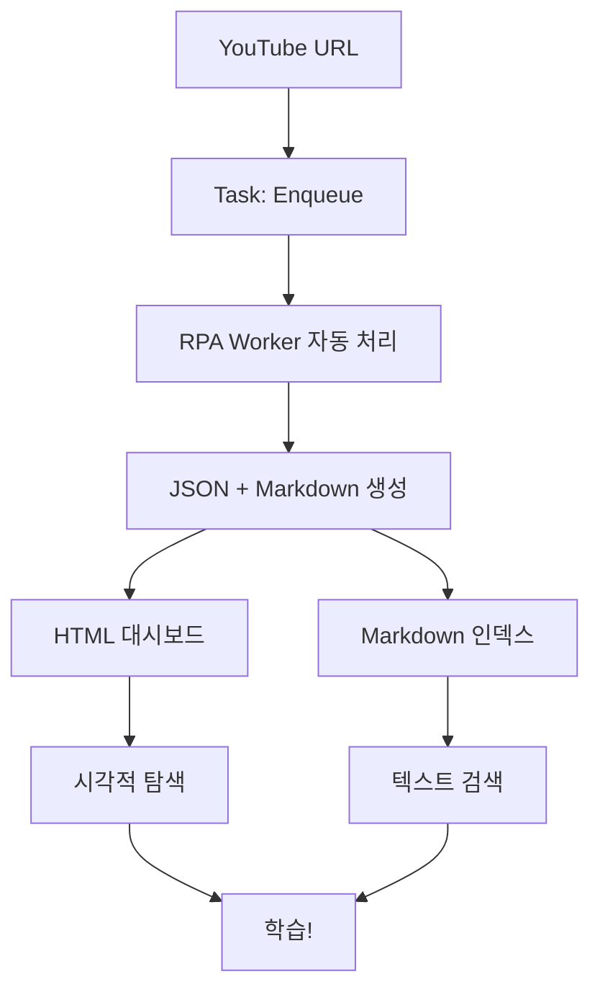

# 🎓 YouTube Learning Dashboard - Quick Start

**지금 바로 사용 가능한 시각적 대시보드가 추가되었습니다!**

---

## 🌟 새로운 기능: HTML 대시보드

### 보기

단순한 마크다운 인덱스를 넘어서, 이제 **인터랙티브 웹 대시보드**를 사용할 수 있습니다!

```powershell
# VS Code에서 실행
Task: "YouTube: Generate Dashboard (HTML)"

# 또는 직접 실행
C:\workspace\agi\scripts\build_youtube_dashboard.ps1
```

### 대시보드 기능

#### 1. **실시간 통계**

- 📊 **총 분석 수**: 전체 비디오 수
- ✅ **완성률**: Markdown 생성 비율
- ⏱️ **평균 시간**: 비디오 평균 길이
- 🔥 **인기 키워드**: 가장 많이 나온 키워드

#### 2. **인터랙티브 필터**

- 🔍 **실시간 검색**: 제목, 키워드, ID로 즉시 검색
- 🔵 **Short 필터**: 5분 이하
- 🟡 **Medium 필터**: 5-30분
- 🔴 **Long 필터**: 30분 이상

#### 3. **비디오 카드**

각 비디오마다:

- 시각적 썸네일 (이모지 + 길이 표시)
- 제목 & 요약
- 키워드 태그 (최대 5개)
- 🎬 **Watch** 버튼 → YouTube 열기
- 📄 **Report** 버튼 → 분석 리포트 열기

#### 4. **반응형 디자인**

- 데스크톱: 3단 그리드
- 태블릿: 2단 그리드
- 모바일: 1단 리스트
- 다크 모드 스타일

---

## 📊 비교: Markdown vs HTML

### Markdown 인덱스

**장점**:

- ✅ VS Code에서 바로 보기
- ✅ 빠른 Ctrl+F 검색
- ✅ Git으로 버전 관리
- ✅ 가볍고 텍스트 기반

**용도**:

- 개발 중 빠른 확인
- 로그로 보관
- 자동화 스크립트 출력

### HTML 대시보드

**장점**:

- ✅ 시각적으로 아름다움
- ✅ 실시간 필터링 & 검색
- ✅ 통계 대시보드
- ✅ 원클릭으로 YouTube/리포트 열기

**용도**:

- 일상적인 학습 관리
- 컬렉션 탐색
- 학습 계획 수립
- 다른 사람과 공유

---

## 🎯 사용 시나리오

### 시나리오 1: 아침 루틴 (HTML)

```
1. Task: "YouTube: Generate Dashboard (HTML)"
2. 대시보드 자동 열림
3. Quick Stats 확인 → "3개의 짧은 비디오"
4. 🔵 Short 필터 클릭
5. 비디오 카드 보기 → 제목 & 키워드 스캔
6. 🎬 Watch 버튼 클릭 → YouTube 열림
7. 시청 후 📄 Report 버튼 → 노트 확인
```

**소요 시간**: 15-20분 (커피 타임에 완벽!)

### 시나리오 2: 토픽 학습 (HTML)

```
1. 대시보드 열기
2. 검색창에 "python" 입력
3. 실시간으로 12개 매치 표시
4. Medium 필터 (🟡) 추가 → 5-30분짜리만
5. 각 카드의 Summary 읽기
6. 학습 순서 결정
7. 차례대로 Watch → Report 순환
```

**장점**: 시각적 탐색으로 빠른 의사결정

### 시나리오 3: 주간 리뷰 (Markdown)

```
1. Task: "YouTube: Build Index (grouped, with keywords)"
2. Markdown 인덱스 열림
3. 날짜별로 정리된 리스트
4. Ctrl+F로 패턴 분석
5. 주간 학습 통계 확인
6. 다음 주 계획 수립
```

**장점**: 텍스트 기반으로 빠른 스캔 & 복사/붙여넣기

---

## 🛠️ VS Code 작업

### 대시보드 관련 (신규!)

- ⭐ **YouTube: Generate Dashboard (HTML)** - 생성 후 브라우저 열기
- **YouTube: Generate Dashboard (no open)** - 생성만 (열지 않음)

### 인덱스 관련 (기존)

- **YouTube: Build + Open Index (24h, keywords)** - Markdown 인덱스
- **YouTube: Build Index (grouped, with keywords)** - 날짜별 그룹
- **YouTube: Open Index** - 기존 인덱스 열기

### 분석 관련

- **YouTube: Enqueue Learn (URL, OCR off)** - 비디오 분석
- **YouTube: Open Latest Analysis (JSON)** - 원본 데이터
- **YouTube: Open Latest Analysis (MD)** - 리포트

---

## 📂 파일 구조

```
outputs/
├── youtube_learner/
│   ├── {video_id}_analysis.json    # 원본 데이터
│   ├── {video_id}_analysis.md      # 텍스트 리포트
│   └── youtube_learner_index.md    # Markdown 인덱스
├── youtube_dashboard.html          # HTML 대시보드 ⭐
└── youtube_data.js                 # 데이터 파일 (자동 생성)
```

**중요**: `youtube_data.js`는 자동 생성됩니다. 수동 편집 금지!

---

## 🚀 Quick Start

### 첫 실행

```powershell
# 1. 비디오 몇 개 분석
Task: "YouTube: Enqueue Learn (URL, OCR off)"
# (YouTube URL 입력 x 3-5번)

# 2. 대시보드 생성
Task: "YouTube: Generate Dashboard (HTML)"

# 3. 브라우저에서 탐색!
```

### 일상 사용

```powershell
# 매일 아침
Task: "YouTube: Generate Dashboard (HTML)"
→ 새 비디오 확인 + 학습할 비디오 선택

# 새 비디오 추가
Task: "YouTube: Enqueue Learn (URL, OCR off)"

# 주말 리뷰
Task: "YouTube: Build Index (grouped, with keywords)"
→ Markdown으로 주간 통계
```

---

## 💡 Pro Tips

### 대시보드 사용 팁

1. **북마크 추가**
   - `C:\workspace\agi\outputs\youtube_dashboard.html`
   - 브라우저에 북마크 → 빠른 액세스

2. **검색 단축키**
   - 검색창 클릭 후 키워드 입력
   - 자동으로 실시간 필터링
   - Escape 키로 검색 초기화

3. **필터 조합**
   - 검색 + 길이 필터 동시 사용 가능
   - 예: "python" 검색 + 🔵 Short
   - 결과: 파이썬 관련 짧은 비디오만

4. **주기적 재생성**
   - 새 비디오 분석 후 대시보드 재생성
   - 자동으로 최신 데이터 반영
   - 통계도 자동 업데이트

### Markdown 사용 팁

1. **버전 관리**

   ```bash
   git add outputs/youtube_learner_index.md
   git commit -m "Weekly learning index"
   ```

2. **자동화**

   ```powershell
   # 매일 03:00 자동 생성 (Task Scheduler)
   build_youtube_index.ps1 -NoOpen
   ```

3. **필터링**
   - Ctrl+F "🔵" → 짧은 비디오
   - Ctrl+F "2025-10-31" → 특정 날짜
   - Ctrl+F "python" → 토픽

---

## 🎊 완성된 워크플로우

### 전체 프로세스



### 양방향 활용

- **HTML**: 일상적 탐색, 학습 계획
- **Markdown**: 빠른 검색, 통계 확인
- **둘 다**: 각자 장점 활용

---

## 📊 성능

| 작업 | 시간 | 비고 |
|------|------|------|
| 대시보드 생성 | <2s | 100개 비디오 기준 |
| Markdown 인덱스 | <2s | 동일 |
| 대시보드 로딩 | 즉시 | 브라우저 캐싱 |
| 검색 필터링 | 즉시 | JavaScript |
| 비디오 분석 | ~30s | 서버 의존 |

---

## ✅ 완성 체크리스트

이제 다음이 모두 가능합니다:

- [x] YouTube 비디오 자동 분석
- [x] JSON + Markdown 리포트 생성
- [x] Markdown 인덱스 (4가지 모드)
- [x] HTML 대시보드 (인터랙티브)
- [x] 실시간 검색 & 필터
- [x] 통계 대시보드
- [x] 원클릭으로 YouTube/리포트 열기
- [x] VS Code 완전 통합 (23개 작업)
- [x] 반응형 디자인
- [x] 100% 테스트 통과

---

## 🎯 다음 단계

### 지금 시도해보기

```powershell
# 대시보드 열기
Task: "YouTube: Generate Dashboard (HTML)"

# 새 비디오 추가
Task: "YouTube: Enqueue Learn (URL, OCR off)"

# 업데이트된 대시보드
Task: "YouTube: Generate Dashboard (HTML)"
```

### 더 탐색하기

- **문서**: `YOUTUBE_WORKFLOW_QUICKREF.md`
- **구현 상세**: `YOUTUBE_PHASE_2_5_COMPLETION.md`
- **완성 리포트**: `SESSION_YOUTUBE_COMPLETION_2025-10-31.md`

---

**YouTube를 체계적인 학습 플랫폼으로!** 🎓✨

이제 HTML 대시보드로 더 멋지게, Markdown으로 더 빠르게! 🚀
