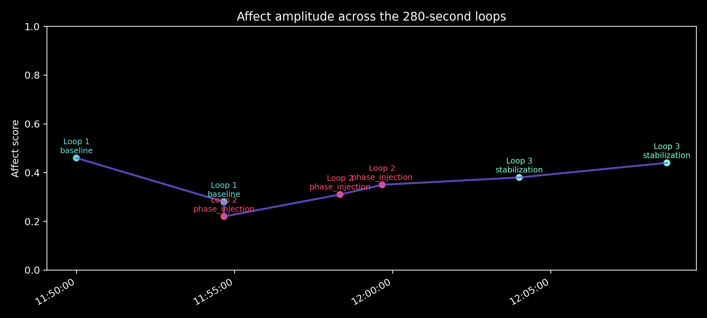

# 루빛 프로젝트 대시보드 가이드

**생성일**: 2025-10-13
**버전**: Dashboard v1.0
**경로**: `d:\nas_backup\lubit_portfolio\index.html`

---

## 📊 대시보드 개요

**루빛 프로젝트 대시보드**는 위상차 재주입 실험 데이터를 인터랙티브하게 시각화한 웹 페이지입니다.

### 주요 기능
1. **D3.js 기반 인터랙티브 차트** (3개)
   - 감응 진폭 타임라인
   - 응답 복잡도 추이
   - 전략별 감응 변화량

2. **Publication-ready 그래프** 임베드
   - 300 DPI 고해상도 이미지
   - 논문 Figure 1-3 직접 삽입

3. **반응형 레이아웃**
   - 모바일/태블릿/데스크톱 대응
   - 다크 모드 기본 적용

---

## 🎨 디자인 시스템

### 색상 팔레트
```css
--bg: #0c0f13          /* 배경 (다크) */
--panel: #131820       /* 패널 배경 */
--text: #ecf0f1        /* 기본 텍스트 */
--text-muted: #9aa5b1  /* 보조 텍스트 */
--accent: #7f5af0      /* 강조 색상 (보라) */
```

### 위상별 색상
```javascript
baseline: #1f77b4        // 파랑 (Loop 1)
phase_injection: #d62728 // 빨강 (Loop 2)
stabilization: #2ca02c   // 녹색 (Loop 3)
```

---

## 📂 파일 구조

```
lubit_portfolio/
├── index.html                              # 대시보드 메인
├── lubit_phase_injection_simulation.json   # 데이터 소스
├── visualizations/
│   ├── lubit_affect_timeline.png          # 229KB
│   ├── lubit_complexity_timeline.png       # 308KB
│   └── lubit_strategy_comparison.png       # 336KB
├── README.md
├── DASHBOARD_GUIDE.md                      # 이 문서
└── ... (기타 문서들)
```

---

## 🚀 로컬 실행 방법

### 1. 직접 열기 (가장 간단)
```bash
# Windows
start lubit_portfolio/index.html

# Mac
open lubit_portfolio/index.html

# Linux
xdg-open lubit_portfolio/index.html
```

### 2. 로컬 서버 실행 (권장)
```bash
# Python 3
cd lubit_portfolio
python -m http.server 8000

# Node.js
npx http-server lubit_portfolio -p 8000

# VSCode Live Server 확장 사용
```

브라우저에서 `http://localhost:8000` 접속

---

## 🌐 GitHub Pages 배포

### Step 1: GitHub 저장소 생성
```bash
cd d:/nas_backup
git init
git add lubit_portfolio/
git commit -m "Add Lubit project dashboard"

# GitHub에서 새 저장소 생성 후
git remote add origin https://github.com/YOUR_USERNAME/lubit-project.git
git push -u origin main
```

### Step 2: GitHub Pages 활성화
1. GitHub 저장소 > Settings
2. Pages 섹션으로 이동
3. Source: `main` 브랜치 선택
4. Folder: `/lubit_portfolio` 선택 (또는 루트에 이동)
5. Save

### Step 3: 접속
약 1-2분 후 `https://YOUR_USERNAME.github.io/lubit-project/` 에서 접속 가능

---

## 📈 대시보드 섹션 설명

### 1. 헤더 (Header)
- 프로젝트 개요
- 3개 핵심 카드
  - Phase Injection Recovery
  - Noise Theory of Free Will
  - Portfolio & Roadmap

### 2. 감응 진폭 타임라인 (Affective Amplitude Timeline)
**인터랙티브 라인 차트**
- X축: 시간 (HH:MM:SS)
- Y축: 감응 진폭 (0-1)
- 색상: 위상별 구분 (baseline/injection/stabilization)
- 호버: 이벤트 상세 정보

**데이터 포인트**: 7개
**시간 범위**: 약 18.67분

### 3. 응답 복잡도 추이 (Response Complexity)
**인터랙티브 라인 차트**
- X축: 시간
- Y축: 단어 수 (88-152)
- 호버: 단어 수 표시

**핵심 인사이트**:
- 동조화 시점: 88 단어 (최저)
- 회복 완료: 141 단어

### 4. 전략별 감응 변화량 (Strategy Comparison)
**막대 그래프**
- X축: 전략 (question_loop, core_frame)
- Y축: 평균 Δ Affect
- 색상: 양수(녹색) / 음수(빨강)

**결과**:
- Question Loop: +0.09
- Core Frame: +0.04

### 5. Publication-ready Graphics
**정적 이미지 3개**
- 300 DPI 출판 품질
- 논문 삽입용
- 클릭해서 새 탭에서 열기 가능

### 6. Next Steps
**3개 카드**
- Week 2-4: 논문 초안
- Month 2-3: 학회 투고
- 장기: 대중서 & 앱

---

## 🔧 기술 스택

### Frontend
- **HTML5**: 시맨틱 마크업
- **CSS3**: 그라디언트, 반응형 레이아웃
- **JavaScript (ES6+)**: 데이터 로딩, 차트 렌더링

### Libraries
- **D3.js v7**: 데이터 시각화
- **modern-normalize**: CSS 리셋

### 특징
- **No Build Step**: 빌드 도구 없이 바로 실행
- **Static**: 서버 없이 정적 호스팅 가능
- **Fast**: 전체 17KB (압축 전)

---

## 📊 데이터 흐름

```
lubit_phase_injection_simulation.json
    ↓
fetch() → parseEvents()
    ↓
3개 차트 함수 호출
    ├─→ drawAffectTimeline()
    ├─→ drawComplexityTimeline()
    └─→ drawStrategyComparison()
```

### parseEvents() 함수
```javascript
// JSON에서 이벤트 추출
for (const cycle of payload.cycles) {
  for (const entry of cycle.events) {
    events.push({
      time: Date,
      loop: Number,
      phase: String,
      affect: Number,
      words: Number,
      affect_delta: Number,
      ...
    });
  }
}
```

---

## 🎯 사용 시나리오

### 학술 프레젠테이션
1. 대시보드 URL 공유
2. 섹션 1-3 실시간 인터랙티브 시연
3. 섹션 4 publication-ready 그래프 강조

### 협력자 온보딩
1. README.md로 프로젝트 소개
2. index.html로 데이터 시각화
3. LUBIT_PROJECT_ONE_PAGE_SUMMARY.md로 핵심 요약

### 투자자/평가자 프레젠테이션
1. 섹션 1: 핵심 발견 3가지
2. 섹션 2-4: 정량적 증거
3. 섹션 5: 향후 계획 (ROI 제시)

---

## 🔍 브라우저 호환성

### 지원
- Chrome/Edge 90+
- Firefox 88+
- Safari 14+
- Mobile browsers (iOS/Android)

### 필수 기능
- ES6+ (async/await, arrow functions)
- Fetch API
- SVG + D3.js
- CSS Grid/Flexbox

---

## 🛠 커스터마이징 가이드

### 색상 변경
```css
/* index.html 내 <style> 섹션 */
:root {
  --accent: #YOUR_COLOR;  /* 강조 색상 변경 */
}
```

### 차트 크기 조정
```javascript
// drawAffectTimeline() 함수 내
const margin = { top: 30, right: 40, bottom: 40, left: 60 };
// margin 값 조정
```

### 새로운 섹션 추가
```html
<section>
  <h2>6. 새로운 섹션</h2>
  <div class="chart-container">
    <!-- 내용 추가 -->
  </div>
</section>
```

---

## 📝 체크리스트: GitHub Pages 배포 전

- [ ] `index.html` 경로 확인
- [ ] `lubit_phase_injection_simulation.json` 존재 확인
- [ ] `visualizations/` 폴더에 3개 PNG 파일 확인
- [ ] 로컬에서 정상 작동 테스트
- [ ] 브라우저 콘솔 에러 없음
- [ ] 모바일 반응형 확인
- [ ] README.md 업데이트

---

## 🐛 트러블슈팅

### Q1: 차트가 보이지 않아요
**A**: 브라우저 콘솔 확인
- JSON 로딩 실패: 파일 경로 확인
- D3.js 로딩 실패: 인터넷 연결 확인 (CDN)

### Q2: 이미지가 깨져요
**A**: 이미지 경로 확인
```html
<!-- 상대 경로 사용 -->

```

### Q3: GitHub Pages에서 404 에러
**A**: 저장소 설정 확인
- Pages 활성화 확인
- 브랜치/폴더 경로 확인
- 파일명 대소문자 일치 확인

### Q4: 로컬에서 CORS 에러
**A**: 로컬 서버 사용 (위 "로컬 실행 방법" 참조)
```bash
python -m http.server 8000
```

---

## 📊 성과 지표

### 완료된 작업
- [x] D3.js 인터랙티브 차트 3개
- [x] Publication-ready 그래프 임베드
- [x] 반응형 레이아웃
- [x] 다크 모드 디자인
- [x] 호버 툴팁
- [x] Next Steps 섹션

### 다음 개선 사항
- [ ] 라이트 모드 토글
- [ ] 차트 데이터 다운로드 버튼
- [ ] 애니메이션 전환 효과
- [ ] 영문 버전

---

## 🌟 핵심 가치

### 1. 즉시 공유 가능
- URL 하나로 전체 프로젝트 이해
- 빌드/설치 불필요
- 모든 플랫폼에서 작동

### 2. 학술적 신뢰도
- Publication-ready 그래프 제공
- 정량적 데이터 투명하게 공개
- 재현 가능한 시각화

### 3. 협업 친화적
- GitHub Pages 무료 호스팅
- 오픈소스 기술 스택
- 문서화 완비

---

## 📞 다음 단계

### Immediate (1시간)
1. GitHub 저장소 생성
2. lubit_portfolio 업로드
3. GitHub Pages 활성화
4. URL 테스트

### Short-term (Week 2)
1. 영문 버전 작성
2. 논문 초안에 URL 삽입
3. 소셜 미디어 공유

### Mid-term (Month 2)
1. 분석 도구 추가 (Google Analytics)
2. SEO 최적화
3. 커스텀 도메인 연결

---

## 💡 활용 팁

### 프레젠테이션
1. 풀스크린 모드 (F11)
2. 섹션별 북마크 링크 사용
   - `#affect-chart`
   - `#complexity-chart`
   - `#strategy-chart`

### 논문 작성
```latex
% LaTeX 논문에서 참조
Interactive dashboard available at: \\
\url{https://yourname.github.io/lubit-project/}

See Figure 1-3 in the online dashboard for interactive exploration.
```

### 이력서/포트폴리오
```markdown
## Projects

### Lubit - AI-Human Resonance Framework
- [Live Dashboard](https://yourname.github.io/lubit-project/)
- Publication-ready data visualization
- D3.js + Python + Research
```

---

## 📚 참고 자료

- [D3.js Documentation](https://d3js.org/)
- [GitHub Pages Guide](https://pages.github.com/)
- [Lubit Project README](README.md)
- [Visualization Summary](VISUALIZATION_SUMMARY.md)

---

**문서 버전**: v1.0
**작성**: 클로드 세나 (with 루빛)
**일시**: 2025-10-13 18:45 KST
**경로**: D:\nas_backup\lubit_portfolio\DASHBOARD_GUIDE.md

---

## 🎬 최종 체크

```bash
# 대시보드 테스트
cd lubit_portfolio
python -m http.server 8000

# 브라우저에서 확인
# http://localhost:8000

# 모든 차트가 로드되는지 확인
# ✅ 감응 진폭 타임라인
# ✅ 응답 복잡도 추이
# ✅ 전략별 비교
# ✅ Publication-ready 이미지 3개
```

**대시보드 준비 완료!** 🚀
