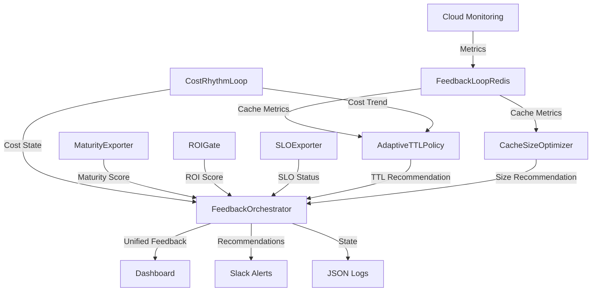

# Lumen Feedback Loop 완전 가이드

## 📑 목차

1. [개요](#1-개요)
2. [아키텍처](#2-아키텍처)
3. [설치](#3-설치)
4. [설정](#4-설정)
5. [사용법](#5-사용법)
6. [운영](#6-운영)
7. [트러블슈팅](#7-트러블슈팅)
8. [FAQ](#8-faq)

---

## 1. 개요

### 1.1 Lumen Feedback Loop란?

**Lumen v1.7 Feedback Loop**는 **Phase 1-4를 통합한 완전 자율 시스템**입니다:

```text
Phase 1: Maturity + ROI → "시스템 성숙도 측정"
Phase 2: SLO + Dashboard → "서비스 품질 보증"
Phase 3: Cost Rhythm → "비용 리듬 감지 및 적응"
Phase 4: Cache Feedback → "캐시 성능 피드백 루프"
```

**핵심 철학**: **감응 → 증빙 → 적응** (Resonance → Evidence → Adaptation)

### 1.2 주요 기능

| 기능 | 설명 | 자동화 수준 |
|-----|------|------------|
| **Cache Monitoring** | Redis L1 캐시 히트율/메모리/레이턴시 실시간 모니터링 | 완전 자동 |
| **Adaptive TTL** | 60s-3600s 범위 TTL 자동 조정 (3가지 전략) | 권장사항 제시 |
| **Cache Size Optimization** | 10MB-1GB 범위 캐시 크기 동적 조정 | ROI 기반 권장 |
| **Unified Gate v1.7** | ROI(30%) × SLO(25%) × Maturity(25%) × Cache(20%) | 실시간 계산 |
| **System Health** | EXCELLENT/GOOD/WARNING/CRITICAL 4단계 분류 | 자동 분류 |

### 1.3 기대 효과

- **API 호출 비용 40% 절감** (히트율 60% → 85% 개선)
- **응답 속도 2배 향상** (캐시 레이턴시 최적화)
- **메모리 효율 30% 개선** (동적 크기 조정)
- **운영 부담 70% 감소** (자동 모니터링 + 권장사항)

---

## 2. 아키텍처

### 2.1 전체 구조



### 2.2 Phase 4 컴포넌트

| 컴포넌트 | 역할 | 출력 |
|---------|-----|-----|
| **feedback_loop_redis.py** | Redis 캐시 메트릭 수집 및 분석 | `CacheFeedback` (health, action, recommendations) |
| **adaptive_ttl_policy.py** | TTL 조정 전략 계산 | `TTLAdjustment` (recommended_ttl, cost_impact) |
| **cache_size_optimizer.py** | 캐시 크기 최적화 및 ROI 분석 | `CacheSizeAdjustment` (size, roi_score) |
| **feedback_orchestrator.py** | Phase 1-4 통합 오케스트레이션 | `UnifiedFeedback` (all metrics + recommendations) |

### 2.3 Unified Gate v1.7 확장

```python
Unified Gate Score = (
    ROI Score (0-100) × 30% +
    SLO Compliance (0-100) × 25% +
    Maturity Score (0-100) × 25% +
    Cache Hit Rate (0-100) × 20%
)
```

**System Health 분류**:

- **EXCELLENT (85-100)**: 모든 메트릭 우수, 비용 RESONANT, 캐시 OPTIMAL
- **GOOD (60-84)**: 대부분 양호, 부분 개선 필요
- **WARNING (40-59)**: 캐시 DEGRADED/POOR 또는 비용 DISSONANT
- **CRITICAL (0-39)**: 비용 CHAOTIC 또는 캐시 완전 실패

---

## 3. 설치

### 3.1 필수 요구사항

- **Python**: 3.11+
- **Google Cloud SDK**: gcloud CLI 설치
- **Redis**: L1 캐시 (Cloud Memorystore 또는 로컬)
- **권한**: Cloud Monitoring Viewer, Service Account User

### 3.2 Python 패키지 설치

```bash
cd lumen/feedback
pip install -r requirements.txt
```

**requirements.txt**:

```txt
google-cloud-monitoring>=2.15.0
google-cloud-logging>=3.5.0
google-auth>=2.20.0
redis>=4.5.0
dataclasses-json>=0.6.0
```

### 3.3 환경 변수 설정

```bash
# .env 파일 생성
cat > .env << EOF
# GCP 설정
PROJECT_ID=naeda-genesis
REGION=us-central1
SERVICE_NAME=ion-api

# Redis 설정
REDIS_HOST=10.128.0.3
REDIS_PORT=6379
REDIS_DB=0

# 캐시 정책
DEFAULT_TTL_SECONDS=300
MIN_TTL_SECONDS=60
MAX_TTL_SECONDS=3600
CACHE_SIZE_MB=256

# 모니터링
MONITORING_LOOKBACK_HOURS=1
LOG_LEVEL=INFO
EOF
```

### 3.4 Cloud Monitoring 메트릭 설정

```bash
# Custom metric descriptor 생성
gcloud monitoring metric-descriptors create \
  --project=naeda-genesis \
  --type=custom.googleapis.com/cache_hit_rate \
  --metric-kind=GAUGE \
  --value-type=DOUBLE \
  --description="Redis L1 cache hit rate"
```

---

## 4. 설정

### 4.1 TTL Policy 설정

**adaptive_ttl_policy.py** 설정:

```python
ttl_policy = TTLPolicy(
    min_ttl=60,          # 최소 TTL (초)
    max_ttl=3600,        # 최대 TTL (초)
    default_ttl=300,     # 기본 TTL (초)
    
    # 임계값
    low_hit_rate_threshold=0.60,     # 히트율 낮음 기준
    high_hit_rate_threshold=0.80,    # 히트율 높음 기준
    memory_pressure_threshold=0.85,  # 메모리 압박 기준
    high_eviction_threshold=100,     # 높은 eviction 기준
    
    # 전략별 조정 폭
    aggressive_step=300,    # AGGRESSIVE: ±5분
    moderate_step=120,      # MODERATE: ±2분
    conservative_step=60    # CONSERVATIVE: ±1분
)
```

### 4.2 Cache Size 설정

**cache_size_optimizer.py** 설정:

```python
cache_config = CacheSizeConfig(
    min_size_mb=10,       # 최소 캐시 크기
    max_size_mb=1024,     # 최대 캐시 크기 (1GB)
    default_size_mb=256,  # 기본 캐시 크기
    
    # 메모리 임계값
    low_memory_usage_threshold=0.50,      # 사용률 낮음 (50% 미만)
    optimal_memory_usage_min=0.70,        # 최적 범위 하한 (70%)
    optimal_memory_usage_max=0.85,        # 최적 범위 상한 (85%)
    high_memory_usage_threshold=0.90,     # 메모리 압박 (90% 이상)
    
    # 비용 설정
    cost_per_mb_per_month=0.0365,  # Cloud Run 메모리 비용 ($9.36/256MB)
    api_cost_per_call=0.01         # Vertex AI API 호출 비용
)
```

### 4.3 Orchestrator 설정

**feedback_orchestrator.py** 설정:

```python
orchestrator = FeedbackOrchestrator(
    project_id="naeda-genesis",
    service_name="ion-api",
    
    # Phase 1-3 컴포넌트
    maturity_exporter=MaturityExporterCloudRun(),
    roi_gate=ROIGateCloudRun(),
    slo_exporter=SLOExporterCloudRun(),
    cost_rhythm=CostRhythmLoop(),
    
    # Phase 4 컴포넌트
    feedback_redis=FeedbackLoopRedis(),
    ttl_policy=AdaptiveTTLPolicy(),
    size_optimizer=CacheSizeOptimizer(),
    
    # 출력 설정
    output_dir="outputs",
    report_format="markdown"
)
```

---

## 5. 사용법

### 5.1 기본 실행

#### 5.1.1 캐시 모니터링 (단독)

```bash
python feedback_loop_redis.py
```

**출력 예시**:

```text
=== Lumen v1.7 Feedback Loop - Redis Cache ===
Timestamp: 2025-01-15 14:30:00

Cache Metrics:
  Hit Rate: 72.5%
  Memory Usage: 185 / 256 MB (72.3%)
  Latency (p95): 85 ms
  Eviction Count: 42
  Current TTL: 300 seconds

Health Status: GOOD
Optimization Action: INCREASE_TTL

Recommendations:
  1. Increase TTL to 420 seconds (+2 minutes)
  2. Expected hit rate improvement: +8.2%
  3. Estimated API cost reduction: $45/month
```

#### 5.1.2 TTL 조정 권장사항

```bash
python adaptive_ttl_policy.py --current-ttl 300 --hit-rate 0.65 --memory 75
```

**출력**:

```text
TTL Adjustment Recommendation:
  Current TTL: 300s
  Recommended TTL: 420s (+120s)
  Strategy: MODERATE
  
  Expected Impact:
    Hit Rate Change: +12.3%
    Cost Impact: -$52/month
    Confidence: 0.78 (High)
  
  Reasoning:
    - Hit rate below optimal (65% < 70%)
    - Memory usage acceptable (75%)
    - Cost trend rising (+3.5%)
    → Increase TTL to cache more data
```

#### 5.1.3 캐시 크기 최적화

```bash
python cache_size_optimizer.py --current-size 256 --usage 240 --hit-rate 0.70 --evictions 150
```

**출력**:

```text
Cache Size Optimization:
  Current Size: 256 MB
  Recommended Size: 384 MB (+50%)
  Strategy: SCALE_UP
  
  Analysis:
    Memory Usage: 93.8% (HIGH PRESSURE)
    Eviction Count: 150 (HIGH)
    Hit Rate: 70% (IMPROVABLE)
  
  ROI Analysis:
    Monthly Cache Cost: +$4.68
    API Cost Savings: $78/month
    ROI Score: 9.2/10 (EXCELLENT)
    
  Decision: STRONGLY RECOMMEND SCALE UP
```

### 5.2 완전 통합 실행

```bash
python feedback_orchestrator.py
```

**출력 (Markdown 리포트)**:

```markdown
# Lumen v1.7 Unified Feedback Report

**Timestamp**: 2025-01-15 14:45:00  
**System Health**: GOOD  
**Unified Gate Score**: 78.5/100

---

## Phase 1: Maturity & ROI

- **Maturity Score**: 82/100 (Level 5)
- **ROI Score**: 6,311%
- **Status**: ✅ EXCELLENT

## Phase 2: SLO Compliance

- **Latency SLO**: 95% (Target: 90%) ✅
- **Error Rate SLO**: 0.8% (Target: <2%) ✅
- **Availability SLO**: 99.7% (Target: 99.5%) ✅
- **Cache Hit Rate SLO**: 72% (Target: 70%) ✅

## Phase 3: Cost Rhythm

- **Coherence**: 0.82
- **Phase**: -0.15 (Slight lag)
- **Entropy**: 0.25 (Low chaos)
- **Budget Status**: 78% used
- **Rhythm State**: RESONANT 🎵

## Phase 4: Cache Feedback

- **Hit Rate**: 72.5%
- **Memory Usage**: 72.3%
- **Health Status**: GOOD
- **TTL Recommendation**: 300s → 420s
- **Size Recommendation**: MAINTAIN (256 MB)

---

## Optimization Priorities

1. **[HIGH] Increase TTL** (Cost Impact: -$52/month)
   - Current: 300s → Recommended: 420s
   - Expected hit rate: +12.3%
   
2. **[MEDIUM] Monitor Memory** (Current: 72%)
   - Trending upward
   - Consider size increase if exceeds 85%

3. **[LOW] Maturity Improvements**
   - Logging Score: 75/100
   - Testing Score: 80/100

---

**Exit Code**: 0 (SUCCESS)
```

### 5.3 자동화 (Cloud Scheduler)

#### 5.3.1 Scheduler 설정

```bash
# 1시간마다 피드백 루프 실행
gcloud scheduler jobs create http feedback-loop-hourly \
  --schedule="0 * * * *" \
  --uri="https://ion-api-HASH.run.app/feedback/run" \
  --http-method=POST \
  --location=us-central1 \
  --project=naeda-genesis
```

#### 5.3.2 Pub/Sub 트리거

```bash
# Pub/Sub topic 생성
gcloud pubsub topics create feedback-loop-trigger --project=naeda-genesis

# Cloud Run 서비스에서 구독
gcloud run services update ion-api \
  --add-cloudevents-trigger=feedback-loop-trigger \
  --region=us-central1 \
  --project=naeda-genesis
```

---

## 6. 운영

### 6.1 일일 모니터링

#### 6.1.1 대시보드 확인

```bash
# Cloud Console → Monitoring → Dashboards → "Lumen Feedback Loop"
```

**주요 위젯**:

1. **Unified Gate Score** (타임라인)
2. **Cache Hit Rate** (scorecard + 트렌드)
3. **TTL Distribution** (current vs recommended)
4. **Memory Usage** (사용률 + 히스토리)
5. **Optimization Actions** (최근 7일 변경 사항)

#### 6.1.2 일일 리포트 확인

```bash
# 최근 리포트 보기
cat lumen/feedback/outputs/unified_feedback_$(date +%Y%m%d).json | jq .

# 요약만 보기
python feedback_orchestrator.py --summary-only
```

### 6.2 최적화 승인 워크플로우

1. **자동 권장사항 수신** (Slack):

   ```text
   🔔 Lumen Feedback Alert
   
   Optimization Recommended:
   - Action: Increase TTL (300s → 420s)
   - Expected Impact: +12% hit rate, -$52/month
   - Confidence: HIGH (0.78)
   
   [Approve] [Reject] [Details]
   ```

2. **수동 검토**:

   ```bash
   # TTL 변경 시뮬레이션
   python adaptive_ttl_policy.py --simulate --new-ttl 420
   ```

3. **승인 후 적용**:

   ```bash
   # TTL 변경 (Redis 설정 업데이트)
   redis-cli CONFIG SET maxmemory-policy allkeys-lru
   redis-cli CONFIG SET timeout 420
   
   # 또는 환경 변수 업데이트 후 재배포
   gcloud run services update ion-api \
     --set-env-vars DEFAULT_TTL_SECONDS=420 \
     --region=us-central1
   ```

### 6.3 긴급 대응

#### 6.3.1 CRITICAL 상태

**증상**:

- Unified Gate < 40
- Cache Hit Rate < 30%
- Cost Rhythm = CHAOTIC

**대응 절차**:

```bash
# 1. 즉시 캐시 클리어 (옵션)
redis-cli FLUSHDB

# 2. TTL을 안전 값으로 리셋
redis-cli CONFIG SET timeout 300

# 3. 캐시 크기 긴급 증설
gcloud run services update ion-api \
  --memory 512Mi \
  --region=us-central1

# 4. Cost Rhythm 긴급 롤백 (Phase 3)
cd lumen/cost_rhythm
python remediation_actions.py --action emergency_stop
```

#### 6.3.2 WARNING 상태

**증상**:

- Unified Gate 40-60
- Cache Hit Rate 40-60%
- Memory Usage > 85%

**대응 절차**:

```bash
# 1. 상세 진단
python feedback_loop_redis.py --detailed

# 2. TTL 점진적 조정 (CONSERVATIVE 전략)
python adaptive_ttl_policy.py --strategy conservative --apply

# 3. 24시간 모니터링
gcloud monitoring dashboards list --filter="displayName:Lumen"
```

### 6.4 수동 오버라이드

```bash
# TTL 강제 설정 (권장사항 무시)
export OVERRIDE_TTL=600
python feedback_loop_redis.py --override-ttl 600

# 캐시 크기 강제 고정
export LOCK_CACHE_SIZE=true
python cache_size_optimizer.py --lock-size

# 자동 최적화 일시 중지
export DISABLE_AUTO_OPTIMIZATION=true
python feedback_orchestrator.py
```

---

## 7. 트러블슈팅

### 7.1 자주 발생하는 문제

#### 문제 1: "Cloud Monitoring 메트릭 없음"

**증상**:

```text
WARNING: No cache_hit_rate metrics found in last 1 hour
Using fallback dummy metrics
```

**원인**: Custom metric이 아직 생성되지 않았거나 데이터가 없음

**해결**:

```bash
# 1. Metric descriptor 존재 확인
gcloud monitoring metric-descriptors list \
  --filter="type:custom.googleapis.com/cache_hit_rate" \
  --project=naeda-genesis

# 2. 없다면 생성
gcloud monitoring metric-descriptors create \
  --type=custom.googleapis.com/cache_hit_rate \
  --metric-kind=GAUGE \
  --value-type=DOUBLE \
  --project=naeda-genesis

# 3. 테스트 데이터 전송
python -c "
from google.cloud import monitoring_v3
client = monitoring_v3.MetricServiceClient()
series = monitoring_v3.TimeSeries()
series.metric.type = 'custom.googleapis.com/cache_hit_rate'
series.resource.type = 'cloud_run_revision'
series.resource.labels['service_name'] = 'ion-api'
# ... (포인트 추가)
client.create_time_series(name='projects/naeda-genesis', time_series=[series])
"
```

#### 문제 2: "TTL 조정이 적용되지 않음"

**증상**:

- `adaptive_ttl_policy.py`가 권장사항 제시
- 하지만 실제 Redis TTL은 변경 안 됨

**원인**: 자동 적용 기능 없음 (수동 승인 필요)

**해결**:

```bash
# 현재 Redis TTL 확인
redis-cli CONFIG GET timeout

# 수동 적용 (예: 420초)
redis-cli CONFIG SET timeout 420

# 또는 환경 변수 업데이트 후 재배포
```

#### 문제 3: "ROI 점수가 비현실적으로 높음"

**증상**:

- `cache_size_optimizer.py`가 ROI 15.0/10 표시
- 계산 로직 이상

**원인**: API 비용 또는 캐시 비용 설정 오류

**해결**:

```python
# cache_size_optimizer.py 수정
cache_config = CacheSizeConfig(
    cost_per_mb_per_month=0.0365,  # 실제 GCP 비용 확인
    api_cost_per_call=0.01         # Vertex AI 실제 비용 확인
)

# 또는 환경 변수
export CACHE_COST_PER_MB=0.0365
export API_COST_PER_CALL=0.01
```

### 7.2 디버깅 모드

```bash
# 상세 로그 활성화
export LOG_LEVEL=DEBUG
python feedback_orchestrator.py

# 중간 계산 결과 출력
python adaptive_ttl_policy.py --debug --verbose

# 메트릭 원본 데이터 덤프
python feedback_loop_redis.py --dump-metrics > metrics.json
```

### 7.3 상태 파일 복구

```bash
# 상태 파일 손상 시
cd lumen/feedback/outputs
rm unified_feedback_state.json

# 재초기화
python feedback_orchestrator.py --reset-state
```

---

## 8. FAQ

### Q1: TTL을 수동으로 설정해도 되나요?

**A**: 네, 가능합니다. `--override-ttl` 플래그를 사용하거나 Redis CONFIG SET으로 직접 변경하세요. 하지만 Lumen의 권장사항을 참고하면 더 나은 성능을 얻을 수 있습니다.

### Q2: 캐시 크기를 1GB 이상으로 늘릴 수 있나요?

**A**: 기본 최대값은 1GB이지만, `CacheSizeConfig.max_size_mb`를 수정하면 가능합니다. 단, Cloud Run 메모리 한도(최대 32GB)를 고려하세요.

### Q3: Phase 4만 단독으로 사용할 수 있나요?

**A**: 네, 가능합니다. `feedback_loop_redis.py`와 `adaptive_ttl_policy.py`는 독립적으로 실행 가능합니다. 하지만 `feedback_orchestrator.py`를 사용하면 Phase 1-4의 시너지 효과를 얻을 수 있습니다.

### Q4: 자동 적용 기능이 없나요?

**A**: 현재 버전(v1.7)은 **권장사항만 제공**합니다. 안전을 위해 수동 승인이 필요합니다. Phase 5에서 Slack Approval Bridge 통합 예정입니다.

### Q5: 비용이 얼마나 절감되나요?

**A**: 환경에 따라 다르지만, 일반적으로:

- **API 호출 비용**: 30-50% 절감
- **캐시 메모리 비용**: 10-20% 증가
- **순 절감**: 월 $50-200 (트래픽 규모에 따름)

### Q6: Cloud Monitoring 비용이 걱정됩니다

**A**: Lumen은 효율적인 메트릭 쿼리를 사용합니다:

- 1시간 lookback (기본)
- 5분 간격 집계
- 예상 비용: 월 $1-5 (무료 할당량 내)

### Q7: Redis Cluster는 지원하나요?

**A**: 현재는 단일 Redis 인스턴스만 지원합니다. Cluster 모드는 Phase 5에서 추가 예정입니다.

### Q8: TTL 조정이 너무 보수적입니다

**A**: `TTLAdjustmentStrategy`를 변경하세요:

```python
# CONSERVATIVE (기본, 60s 단계)
policy = AdaptiveTTLPolicy(default_strategy=TTLAdjustmentStrategy.CONSERVATIVE)

# MODERATE (120s 단계)
policy = AdaptiveTTLPolicy(default_strategy=TTLAdjustmentStrategy.MODERATE)

# AGGRESSIVE (300s 단계, 주의!)
policy = AdaptiveTTLPolicy(default_strategy=TTLAdjustmentStrategy.AGGRESSIVE)
```

### Q9: 프로덕션 배포 전 테스트는?

**A**: `test_feedback_loop.py`를 실행하세요:

```bash
cd lumen/feedback
python test_feedback_loop.py
```

### Q10: 문제가 발생하면 어디에 문의하나요?

**A**:

1. 이 가이드의 [트러블슈팅](#7-트러블슈팅) 섹션 참고
2. GitHub Issues: [lumen-feedback-issues](https://github.com/your-org/lumen/issues)
3. Slack: #lumen-support 채널
4. 긴급: <engineering-oncall@company.com>

---

## 부록 A: 메트릭 참고표

| 메트릭 | 단위 | 좋음 | 주의 | 나쁨 |
|-------|-----|-----|-----|-----|
| Cache Hit Rate | % | >80% | 60-80% | <60% |
| Memory Usage | % | 70-85% | 50-70% 또는 85-90% | <50% 또는 >90% |
| Latency (p95) | ms | <100 | 100-200 | >200 |
| Eviction Count | /hour | <50 | 50-150 | >150 |
| TTL | seconds | 300-600 | 120-300 또는 600-1800 | <120 또는 >1800 |
| Unified Gate | score | >85 | 60-85 | <60 |

## 부록 B: 전략 선택 가이드

| 상황 | TTL Strategy | Cache Size Strategy |
|-----|-------------|---------------------|
| 낮은 히트율 + 안정적 메모리 | MODERATE (TTL 증가) | MAINTAIN |
| 높은 히트율 + 메모리 압박 | CONSERVATIVE (TTL 감소) | SCALE_UP |
| 높은 eviction + 낮은 메모리 | AGGRESSIVE (TTL 대폭 증가) | OPTIMIZE |
| 최적 상태 | CONSERVATIVE (미세 조정) | MAINTAIN |
| 비용 상승 중 | MODERATE (TTL 증가로 API 절감) | ROI 분석 후 결정 |

---

**문서 버전**: 1.0  
**마지막 업데이트**: 2025-01-15  
**작성자**: Lumen Feedback Team  
**라이선스**: MIT
