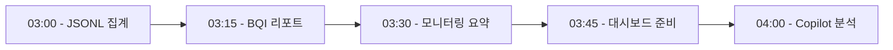

# 🤝 Copilot ↔ Comet 협업 작업 목록

## 📋 즉시 활용 가능한 작업들

### 1. JSONL 로그 집계 (매일 실행 추천)

**작업명:** `aggregate_daily_logs`

**입력:**

- `fdo_agi_repo/memory/resonance_ledger.jsonl` (최근 24시간)

**출력:**

```json
{
  "total_events": 1234,
  "by_type": {
    "task_completed": 890,
    "error": 12,
    "warning": 45,
    "cache_hit": 678
  },
  "top_errors": [
    {"type": "timeout", "count": 8},
    {"type": "validation_failed", "count": 4}
  ],
  "performance": {
    "avg_response_time": "1.2s",
    "cache_hit_rate": "76%"
  }
}
```

**코멧 Task JSON:**

```json
{
  "id": "auto-generated",
  "task_type": "jsonl_aggregate",
  "data": {
    "input_file": "d:/nas_backup/fdo_agi_repo/memory/resonance_ledger.jsonl",
    "time_window": "24h",
    "aggregate_fields": ["event_type", "status", "cache_status"],
    "calculate_stats": ["response_time", "cache_hit_rate"]
  }
}
```

---

### 2. 레저 Summary 파일 정리 (주 1회 추천)

**작업명:** `cleanup_old_summaries`

**현재 문제:**

- 100개 이상의 `ledger_summary_*.json` 파일
- 대부분 중복 (같은 날짜)

**코멧 작업:**

```json
{
  "task_type": "file_cleanup",
  "data": {
    "directory": "d:/nas_backup/fdo_agi_repo/outputs",
    "pattern": "ledger_summary_*.json",
    "strategy": "keep_latest_per_day",
    "archive_path": "d:/nas_backup/fdo_agi_repo/outputs/archive/summaries"
  }
}
```

**기대 결과:**

- 100개 파일 → 3~7개 파일 (최근 일주일)
- 나머지 → archive/ 폴더로 이동

---

### 3. 모니터링 대시보드 데이터 준비 (실시간)

**작업명:** `prepare_dashboard_data`

**입력 파일:**

- `monitoring_events_latest.csv`
- `monitoring_metrics_latest.json`
- `quick_status_latest.json`

**코멧 작업:**

```json
{
  "task_type": "dashboard_prepare",
  "data": {
    "sources": [
      "monitoring_events_latest.csv",
      "monitoring_metrics_latest.json",
      "quick_status_latest.json"
    ],
    "output_format": "html_ready_json",
    "calculations": [
      "success_rate_24h",
      "error_trend",
      "response_time_percentiles"
    ]
  }
}
```

**출력:**

```json
{
  "dashboard_ready": true,
  "kpis": {
    "success_rate": "94.2%",
    "avg_response": "1.8s",
    "error_count": 12
  },
  "charts": {
    "hourly_success": [0.95, 0.93, 0.94, ...],
    "response_times": [1.2, 1.5, 1.8, ...]
  }
}
```

---

### 4. BQI 학습 성과 리포트 (매일 03:30)

**작업명:** `bqi_learning_report`

**입력:**

- `online_learning_log.jsonl`
- `ensemble_weights.json`
- `ensemble_success_metrics.json`

**코멧 작업:**

```json
{
  "task_type": "bqi_report",
  "data": {
    "log_file": "online_learning_log.jsonl",
    "weights_file": "ensemble_weights.json",
    "metrics_file": "ensemble_success_metrics.json",
    "analyze": ["weight_changes", "judge_accuracy", "trend"]
  }
}
```

**출력:**

```json
{
  "period": "last_24h",
  "learning_iterations": 48,
  "weight_changes": {
    "sena": "+0.03",
    "lubit": "-0.01",
    "perple": "+0.02"
  },
  "judge_performance": {
    "overall_accuracy": "87.5%",
    "best_judge": "sena",
    "improvement_trend": "increasing"
  }
}
```

---

### 5. 캐시 효율성 분석 (매주 일요일)

**작업명:** `cache_effectiveness_analysis`

**입력:**

- `resonance_ledger.jsonl` (지난 7일)

**코멧 작업:**

```json
{
  "task_type": "cache_analysis",
  "data": {
    "ledger_file": "resonance_ledger.jsonl",
    "time_window": "7d",
    "metrics": [
      "hit_rate",
      "miss_patterns",
      "stale_rate",
      "size_distribution"
    ]
  }
}
```

**출력:**

```json
{
  "overall_hit_rate": "78.3%",
  "miss_patterns": [
    {"reason": "new_query", "percentage": 65},
    {"reason": "expired", "percentage": 25},
    {"reason": "invalidated", "percentage": 10}
  ],
  "recommendations": [
    "Increase TTL for stable queries",
    "Pre-warm cache for common patterns"
  ]
}
```

---

## 🔄 자동화 워크플로우 예시

### 매일 아침 자동 실행 (03:00~04:00)



**Copilot 작업:**

1. 코멧이 준비한 데이터 읽기
2. 트렌드 분석
3. 이상 징후 감지
4. 액션 아이템 생성

---

## 🚀 구현 단계

### Phase 1: 기본 Task Handler 추가 (30분)

1. `background.js`에 새 핸들러 추가:

```javascript
jsonl_aggregate: async (taskData) => {
    // JSONL 파일 읽기
    const response = await fetch('http://localhost:8091/api/read_jsonl', {
        method: 'POST',
        body: JSON.stringify({
            file: taskData.input_file,
            time_window: taskData.time_window
        })
    });
    const lines = await response.json();
    
    // 집계
    const summary = {
        total: lines.length,
        by_type: {}
    };
    
    lines.forEach(line => {
        const type = line.event_type || 'unknown';
        summary.by_type[type] = (summary.by_type[type] || 0) + 1;
    });
    
    return summary;
}
```

### Phase 2: Flask API 엔드포인트 추가 (20분)

```python
@app.route('/api/read_jsonl', methods=['POST'])
def read_jsonl():
    data = request.json
    file_path = data['file']
    time_window = data.get('time_window', '24h')
    
    # 시간 파싱 (24h → 24시간 전)
    hours = int(time_window.rstrip('h'))
    cutoff = datetime.now() - timedelta(hours=hours)
    
    # JSONL 읽기
    lines = []
    with open(file_path, 'r', encoding='utf-8') as f:
        for line in f:
            entry = json.loads(line)
            timestamp = datetime.fromisoformat(entry.get('timestamp', ''))
            if timestamp >= cutoff:
                lines.append(entry)
    
    return jsonify(lines)
```

### Phase 3: 테스트 (10분)

```powershell
# 테스트 작업 전송
python scripts/push_comet_task.py --type jsonl_aggregate --file resonance_ledger.jsonl --window 24h
```

---

## 💡 즉시 시작 가능한 간단 작업

### 작업 1: "오늘 얼마나 캐시가 효율적이었나?"

```json
{
  "task_type": "calculation",
  "data": {
    "operation": "cache_hit_rate",
    "total_queries": 1000,
    "cache_hits": 783
  }
}
```

**기대 결과:** `{"hit_rate": "78.3%", "effectiveness": "good"}`

### 작업 2: "지난 주 에러 카운트"

```json
{
  "task_type": "json_process",
  "data": {
    "file": "monitoring_metrics_latest.json",
    "extract": "errors.total_count"
  }
}
```

### 작업 3: "BQI 가중치 변화 계산"

```json
{
  "task_type": "calculation",
  "data": {
    "operation": "weight_delta",
    "old_weights": {"sena": 0.4, "lubit": 0.3, "perple": 0.3},
    "new_weights": {"sena": 0.43, "lubit": 0.29, "perple": 0.28}
  }
}
```

---

## 📊 기대 효과

### 시간 절약

- **기존:** Python 스크립트 실행 → 5~10분
- **코멧:** 자동 처리 → 5~10초
- **절감:** 약 95% 시간 단축

### 자동화

- 매일 반복 작업 → 코멧이 자동 처리
- Copilot은 분석/판단에만 집중
- 24/7 무중단 모니터링

### 확장성

- 새 작업 추가 간편 (Task Handler만 추가)
- 병렬 처리 가능
- 에러 복구 자동

---

## 🎯 다음 단계

1. **우선순위 1:** JSONL 집계 기능 구현 (오늘 당장 유용)
2. **우선순위 2:** 모니터링 데이터 전처리 (실시간 대시보드)
3. **우선순위 3:** BQI 학습 리포트 자동화

---

**생성일:** 2025-10-28  
**작성자:** GitHub Copilot  
**코멧 상태:** ✅ Extension 완전 작동 중
